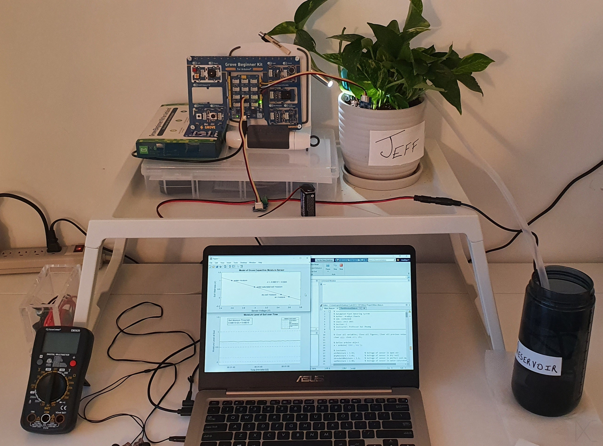
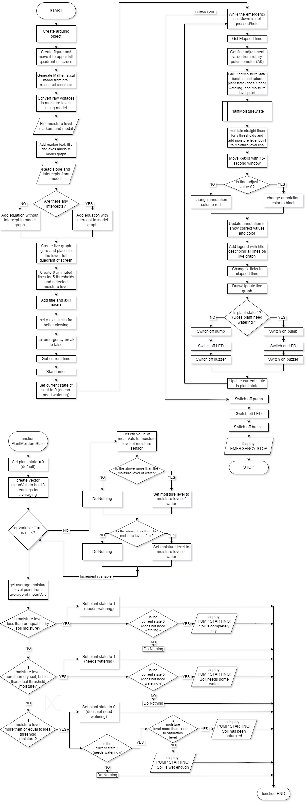
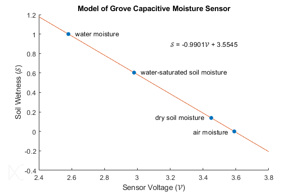

# MATLAB | Automated Plant Watering System
### OBJECTIVE
The objective of this project was to design and develop an automated plant-watering system using the Grove Beginner Kit For Arduino interfaced through MATLAB. The system was created to operate autonomously by monitoring soil moisture and activating or deactivating a water pump as required.

  

### SYSTEM DESIGN
The system was designed based on a capacitive soil-moisture sensor connected to the Seeeduino Lotus, which provides the input used to determine when the plant requires watering. A water pump, controlled through a MOSFET, is activated when the measured soil moisture falls below the defined threshold.

Additional components, such as a rotary potentiometer allows the user to adjust the target moisture threshold (by a factor of +/- 0.5) to accommodate plants with different watering requirements. An LED and buzzer provide visual and audible feedback while the pump is operating. A push button provides a manual shutdown function that can also be used in case of a critical failure.

MATLAB handles the system control logic, sensor-data acquisition, calibration, moisture modelling, real-time visualization, and user feedback. Together, these components allow the system to automatically monitor and regulate soil moisture while still providing the user with crucial information and manual control.

### OUTCOMES
The completed system successfully monitored soil moisture, controlled the water pump based on the calibrated moisture threshold, and provided real-time visual and audible feedback to the user. The capacitive moisture sensor, mathematical model, and live MATLAB graph operated as intended, while the rotary potentiometer and push button provided adjustable threshold control and manual shutdown functionality.

Overall, the project successfully integrates sensor calibration, MATLAB-based control, real-time data visualization, and hardware interfacing.

A key limitation of the design is its dependence on a computer running MATLAB. Future development could instead deploy a smaller integrated processing and display solution, such as a Raspberry Pi or similar platforms. This would allow the system to operate independently while retaining it's monitoring, control, and feedback capabilities.
